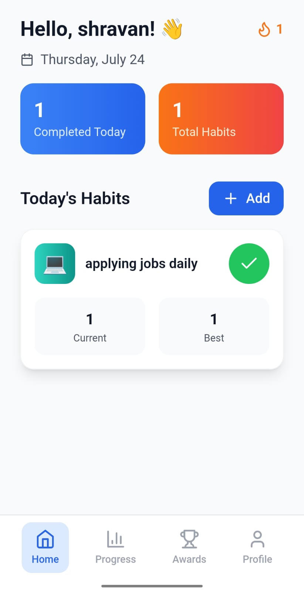
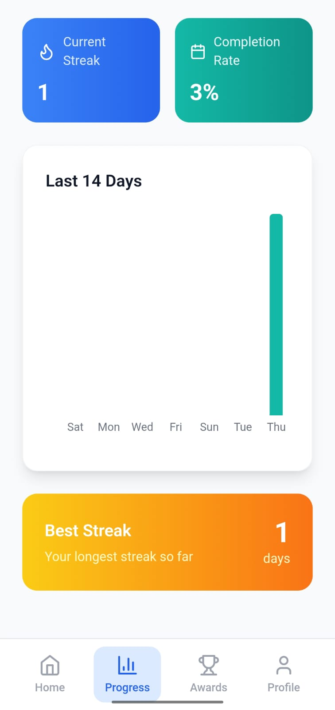
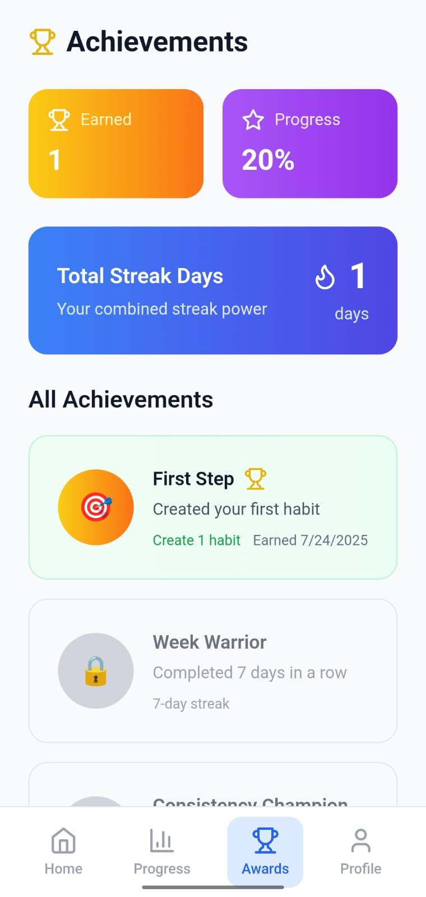

# Habit Tracker

A full-stack habit tracking application built with the **MERN** stack (MongoDB, Express, React, Node.js).  
Track your daily habits, visualize your progress, and unlock achievements!

## 🖥️Live Demo : [habit-tracker-frontend-cqqj.onrender.com](https://habit-tracker-frontend-cqqj.onrender.com)

---

## 🚀 Features

- **User Authentication** (JWT-based)
- **Add, Edit, Delete Habits**
- **Daily Habit Logging**
- **Progress Visualization**
- **Achievements & Streaks**
- **Responsive UI** (Tailwind CSS)
- **Dark Mode Support**

---

<h2 align="center">📸 Dashboard Screenshot</h2>
<p align="center">
  
</p>

<h2 align="center">📈 Progress Screenshot</h2>
<p align="center">
  
</p>

<h2 align="center">🏆 Awards Screenshot</h2>
<p align="center">
  
</p>

---

## ⚡ Getting Started

### Prerequisites

- Node.js (v16+)
- npm or yarn
- MongoDB (local or Atlas)

### 1. Clone the repository

```bash
git clone https://github.com/yourusername/habit-tracker.git
cd habit-tracker
```

### 2. Setup Backend

```bash
cd server
npm install
```

Create a `.env` file in `/server`:

```
MONGODB_URL=your_mongodb_connection_string
JWT_SECRET=your_jwt_secret
NODE_ENV=development
PORT=5000
```

Start the backend:

```bash
npm run dev
```

### 3. Setup Frontend

```bash
cd ../
npm install
```

Create a `.env` file in the root:

```
VITE_API_URL=http://localhost:5000/api
```

Start the frontend:

```bash
npm run dev
```

---

## 🌐 Deployment

- Set environment variables in your deployment platform (Render, Vercel, Netlify, etc.).
- For production, set `VITE_API_URL` in the frontend to your deployed backend URL.

---

## 📁 Folder Structure

```
Habit-Tracker/
  server/         # Express backend
  src/            # React frontend
  ...
```

---

## 📄 License

MIT

---

## 🤝 Contributing

Pull requests are welcome! For major changes, please open an issue first to discuss what you would like to change.
